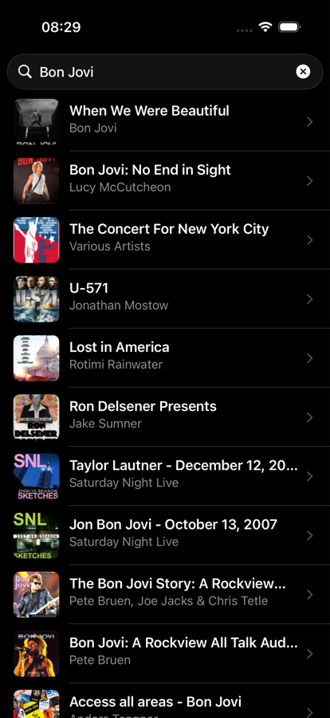

# iTunesSearch

Search the iTunes catalogue and listen to 30-second previews.
Built with UIKit, no storyboards, VIPER architecture.

| Search | Track | Error state |
|:--:|:--:|:--:|
|  |  |  |

## Features

- Search tracks, albums and audiobooks through the public iTunes Search API
- 30-second preview playback, audible even with the ringer switch off
- Explicit screen states: idle, loading, results, empty, failure
- In-flight requests are cancelled when a newer search starts
- Light and dark appearance
- English and Russian localization via a String Catalog

## Requirements

- iOS 13.0+
- Xcode 15+
- CocoaPods

## Getting started

```bash
git clone git@github.com:nevzorov46/iTunesSearch.git
cd iTunesSearch
pod install
open iTunesSearch.xcworkspace
```

`Pods/` is not tracked in this repository, so `pod install` is required before
the first build. Open the `.xcworkspace`, not the `.xcodeproj`.

## Architecture

Two VIPER modules — `ListOfSongs` and `SongDetails`. Every arrow crosses a
protocol, so each layer can be replaced with a test double.

| Layer | Responsibility |
|---|---|
| View | Renders a state, forwards user events. Knows nothing about other modules. |
| Presenter | Owns the screen state and the list of results, decides what to show. |
| Interactor | Talks to the network, hands results back on the main thread. |
| Router | Assembles the module and performs navigation. |
| Entity | `SongModel` decoded from the API, plus display helpers. |

### One state instead of several flags

The screen cannot end up in a contradictory state — for example a spinner
running while an empty-results label is visible — because there is a single
value describing it:

```swift
enum ListOfSongsState {
    case initial
    case loading
    case loaded([SongModel])
    case empty
    case failed(String)
}
```

The view exposes exactly one method, `render(_:)`. The decision of which state
to enter lives in the presenter, not in the view controller.

### A single threading boundary

`URLSession` calls back on a background queue. Rather than sprinkling
`DispatchQueue.main.async` across the UI, the interactor hops once — and
everything above it is main-thread only:

```swift
network.getSongs(name) { [weak self] result in
    DispatchQueue.main.async { ... }
}
```

That invariant is written down in `ListOfSongsInteractorOutputProtocol`, and it
is the only dispatch in the project.

### Errors are values

The network layer returns `Result<ResultModel, NetworkError>`, so no code path
can quietly swallow a failure — every branch has to produce something:

```swift
enum NetworkError: LocalizedError {
    case invalidURL
    case transport(Error)
    case emptyResponse
    case decoding(Error)
    case cancelled
}
```

`cancelled` is the one case never shown to the user: it means a newer search
replaced this request, which is not a failure worth reporting.

## Project structure

```
iTunesSearch/
├── ListOfSongs/            # search screen module
│   ├── Entity/             # SongModel and display helpers
│   ├── Interactor/         # network access, main-thread boundary
│   ├── Presenter/          # screen state and decisions
│   ├── Router/             # module assembly and navigation
│   └── View/               # view controller, cell, view protocol
├── SongDetails/            # track screen module
├── NetworkService.swift    # URLSession wrapper behind a protocol
├── Resources.swift         # API endpoint and localized strings
└── Supporting Files/       # app delegates, assets, string catalog
```

## What I'd change today

This started as a take-home assignment in October 2023 and was revisited in
2026 — the commit history shows both passes. Things I'm aware of and would
address next:

- **No tests yet.** The seams are in place — the network service is injected
  behind a protocol, the router sits behind a protocol, the presenter holds the
  state — so unit tests are the natural next step.
- **CocoaPods.** Kept from the original project. SPM would be the choice today.
- **Completion handlers instead of `async/await`.** The `Result`-based API is
  safe, but structured concurrency would remove the callback nesting entirely.
- **Playback lives in the view controller.** `AVQueuePlayer` belongs in a
  dedicated service that publishes its state, so the presenter would not have to
  track `isPlaying` separately.
- **No pagination.** The API supports `limit` and `offset`; results are
  currently capped at the default page.

## License

Educational project, no license.
